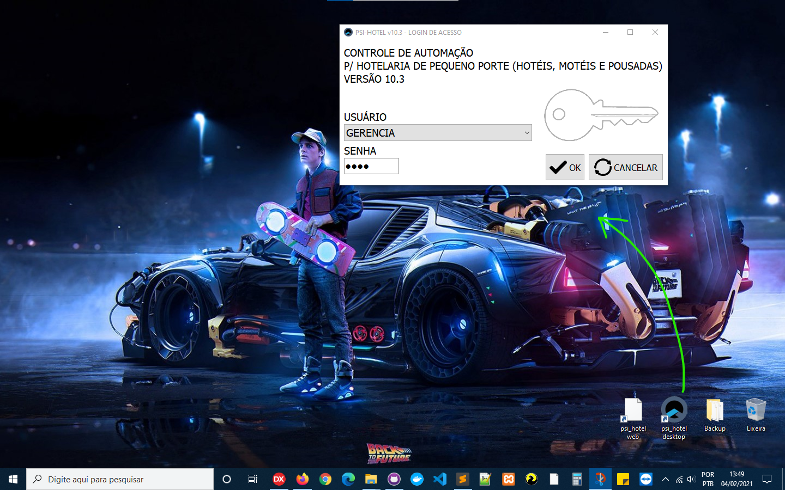
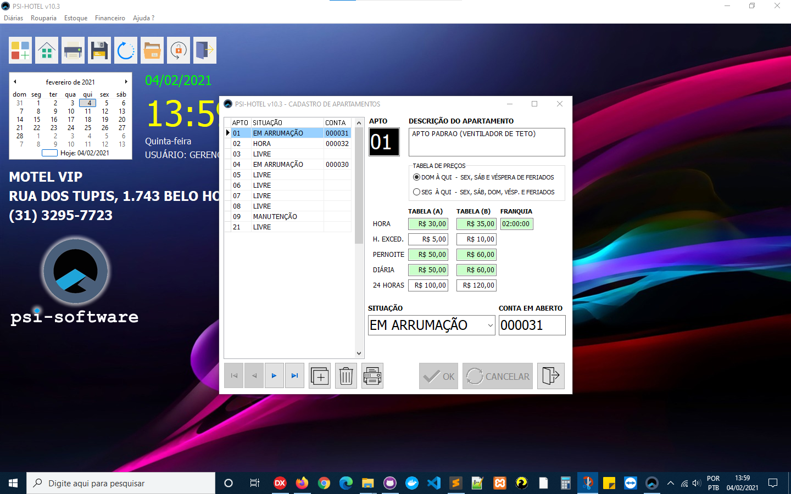
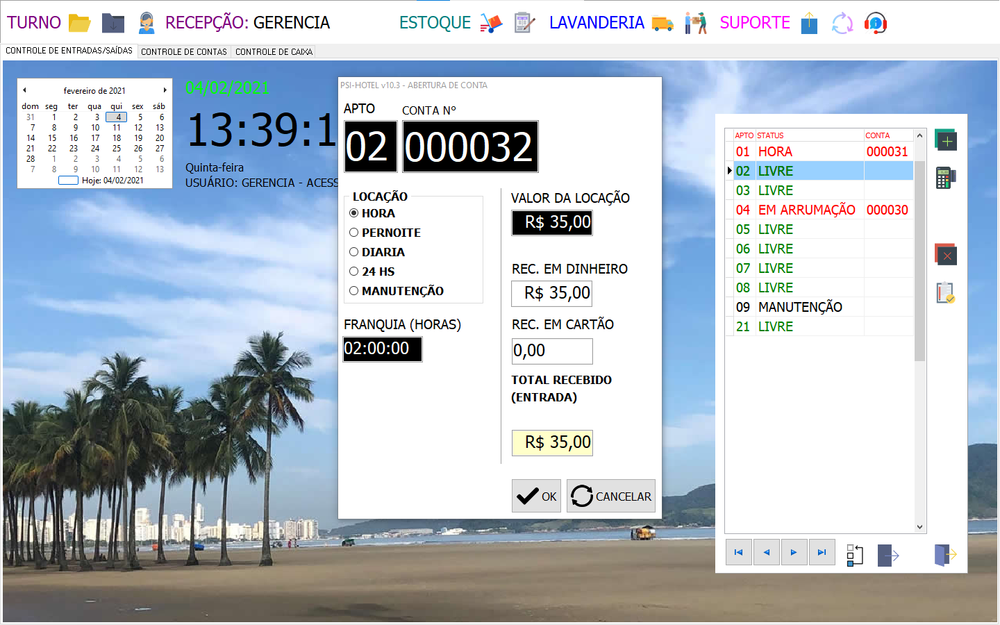
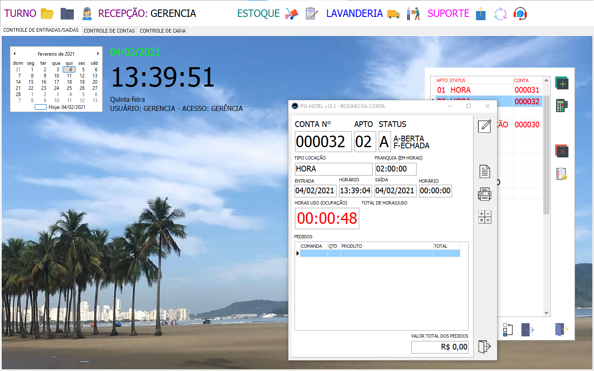
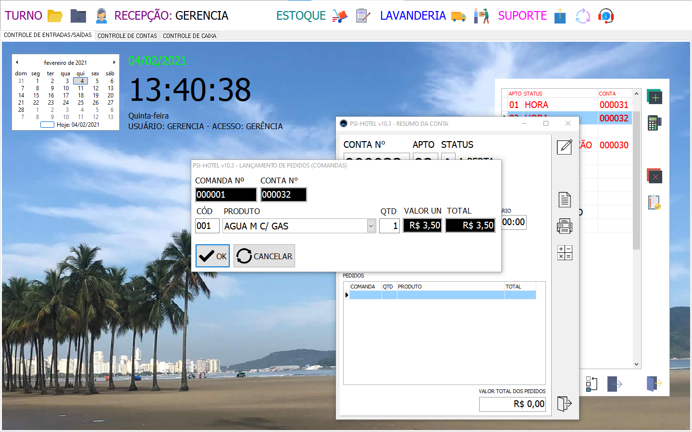
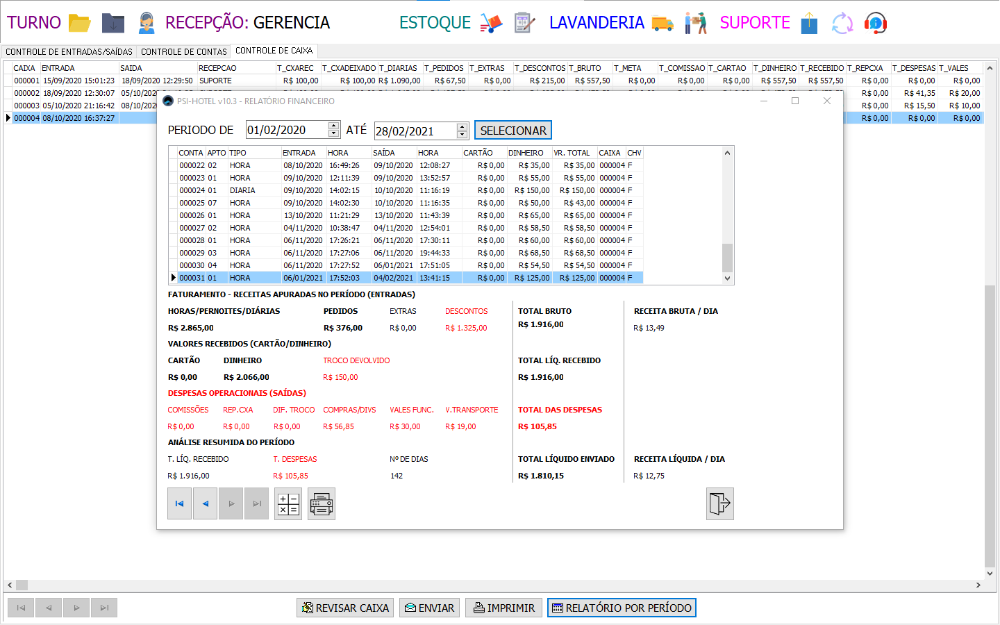

 
## PSI-HOTEL VCL-DESKTOP v10.3
Sistema para Hotelaria de Pequeno Porte (hotéis, motéis e pousadas) 
<table>
  <tbody>
    <tr>
      <td></td>
      <td></td>
      <td></td>
    </tr>
    <tr>
      <td></td>
      <td></td>
      <td></td>
    </tr>
  </tbody>
</table>

## Descrição
Projeto Desenvolvido para ambiente Desktop (Windows) em Delphi 10.3.3 Community Edition, utilizando componentes nativos da Visual Components Library (VCL), com FireDAC para conexão com o banco de dados MySQL e integração c/ PHP para envio de dados e relatórios via SMTP usando componentes da paleta Indy.

## Histórico 
Projeto original desenvolvido por Ezequias Martins, inicialmente um modelo de aplicação Desktop c/ Borland Delphi 5 usando componentes VCL (Visual Component Library), dentro do modelo de Programação Orientada a Objetos (POO), com sua base de dados em tabelas Paradox. O projeto foi sendo atualizado ao longo dos anos o surgimento da versão Borland Delphi 7 em 2002, e nela o projeto foi otimizado e aprimorado, tendo a base de dados migranda finalmente para o MySQL desde então. A partir de 2018, com o surgimento do RAD Studio 10 da Embarcadero, foi todo restruturado na versão 10.3.3 Community Edition e agora vem sendo atualizado para a versão Web c/ uso de componentes Intraweb + templates em HTML5/CSS, utilizando o framework Bootstrap e Javascript.

## monetização

Quer ganhar R$20? 
- não é fake, baixe e instale o App do PagBank do PagSeguro UOL, vc ganha R$ 20,00  e me ajuda também. Use meu link de indicação para abrir uma conta grátis no PagBank pelo celular. Faça uma recarga de celular ou pague uma conta, e pronto! (eu mesmo já utilizo a muito tempo inclusive para pagamentos e transferência via Pix).

Obrigado!

Ezequias Martins
🤓 👍

https://indicapagbank.page.link/QduumcKgCNC8eKcY9

by <a href="https://ezequiasmartins.blogspot.com/" target="_blank">Ezequias Martins</a> ® 1999-2021 Direitos Reservados

